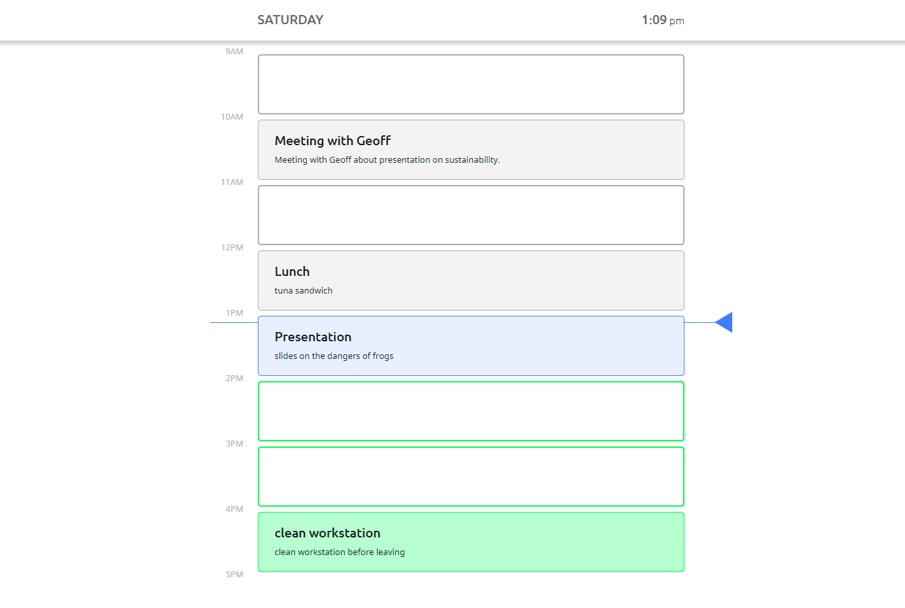
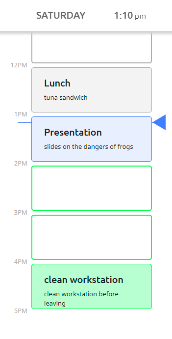
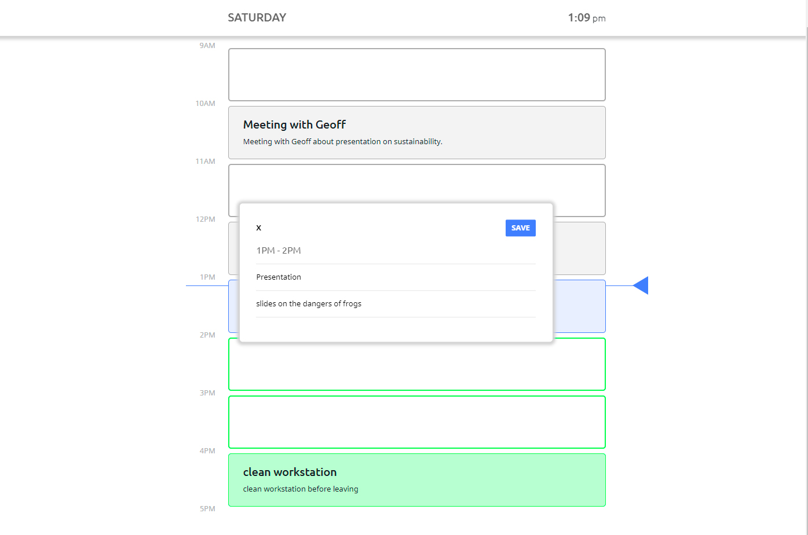

# Day Planner
## Overview
 This is a website that uses jquery, moment.js and local storage to create a day planner.
 
 [Click here to go to site](https://nick75mowbray.github.io/wk5_day_planner/)
 ### Features
 Display of current day and time.\
 Current time indicator that changes position on the page depending on the time.\
 Information entered by the user is stored in local storage.
 ### Screenshots

### How it works
The day and time are fetched using moment.js and updated every second using setInterval to ensure the correct time displayed without the user re-freshing the page.\
The timeblocks are styled differently using classes for past, present and future and applied to the time block depending on the current hour and the value assigned to the time block, eg 9am to 10am has a value of 9, so when the hour is equal to 9 a class of present is applied to that time block.\
There is a line that moves down the page that represents the current time and its position corresponds to the timelegends on the side of the page.\
The current time line gets its position on the page by calculating the pixels from the top of the page based on the current hour and minutes.\
The event data (event title and event description) is stored as a JSON object in local storage, and retrieved when the page is loaded or the user updates the information for an event.
